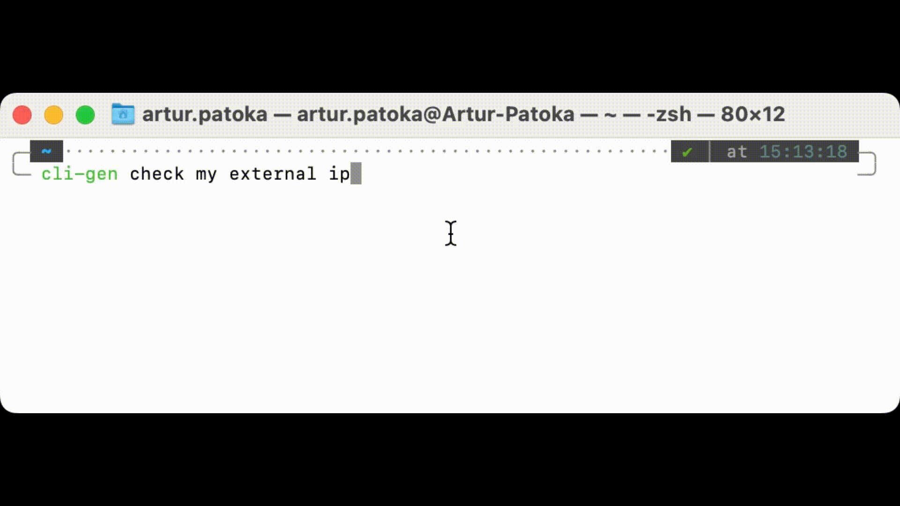

# cli-gen - your terminal wizzard
Harness the power of GPT directly from your bash/zsh/fish terminal. Just
tell it what you would like to achieve.


## How
- `cli-gen get my local ip`
- `cli-gen check if the internet is working`
- `cli-gen list all python files in the directory above the current one`

## Installation
Run the following:
```
git clone https://github.com/arturpat/cli-gen.git
cd cli-gen
. ./install.sh
```
This will install the requirements and set the alias in your terminal's config file (if not present).
The script will guide you to set up your OpenAI api key

## Supported terminals
- zsh
- Bash
- Fish

## Known issues
- Sometimes GPT will refuse to answer (`I don't know how to help with that.`). 
You can select `(R)etry`, keep your fingers crossed and wait for another try.

## Contributing
- Utilise the pre-configured pre-commit. Run `pre-commit run --all-files` before pushing your changes.
- The checks will also be executed against any opened PR
